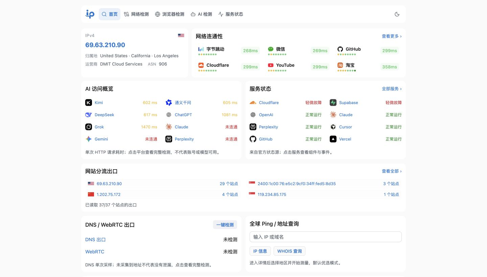
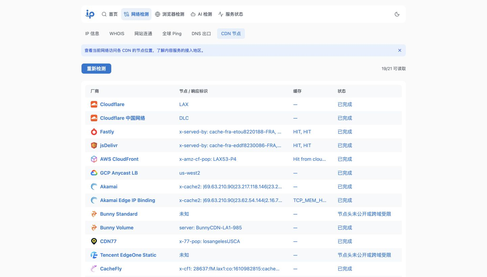
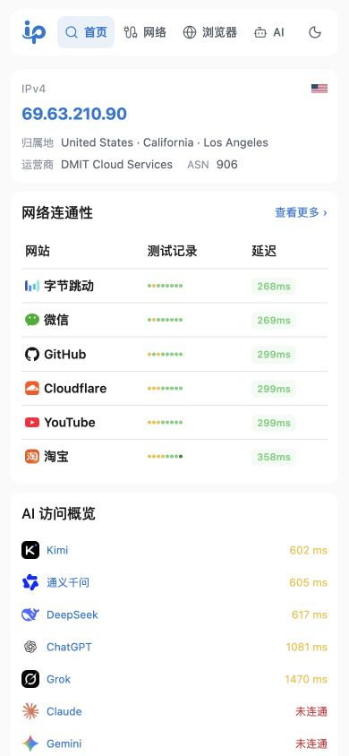
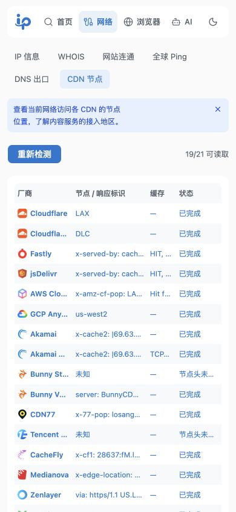

<div align="center">

# One IP

一个集 IP 查询、网络诊断、浏览器检测和 AI 服务状态于一体的工具箱。


[功能特性](#-功能特性) · [界面预览](#-界面预览) · [部署方法](#-部署方法) · [本地开发](#-本地开发) · [配置说明](#-配置说明) · [使用说明](#-使用说明)

</div>

## ✨ 功能特性

| 模块       | 功能                                                                            |
| ---------- | ------------------------------------------------------------------------------- |
| 首页       | IPv4 / IPv6 出口、分流汇总、网络连通性、浏览器指纹、WebRTC、AI 访问与服务状态   |
| IP 信息    | 公网 IP 归属地、运营商、ASN、地图、多源对比及可选风险信息                       |
| WHOIS      | 域名、IP、ASN 的 RDAP 注册信息，支持状态、DNS、时间与实体详情                   |
| 网络诊断   | 网站分流、HTTP 连通性、全球 ICMP Ping、DNS 出口和 CDN 命中节点                  |
| 浏览器检测 | 环境信息、指纹、环境一致性、自动化特征、权限隐私与验证码体验                    |
| AI 平台    | ChatGPT、Claude、Gemini、DeepSeek、Grok、Perplexity、通义千问和 Kimi 的访问检测 |
| 服务状态   | 聚合官方数据，按分类展示运行情况，点击查看组件与事件                            |

- **移动端导航**：底部悬浮液态玻璃菜单，五个入口完整显示；支持深浅主题、安全区和减少透明度偏好。二级菜单可横向滚动，桌面保留顶部导航。
- **紧凑布局**：手机首页采用双列连通性卡片，归属信息减少重复标签；无 IPv6、无 WebRTC 地址等情况不展示空结果区域。
- **手机服务状态**：故障与维护优先，三项紧凑统计与分组列表突出服务状态和事件；分类、时间等细节点击后查看。页面用途说明使用低对比度辅助文字。
- **响应式详情**：桌面弹窗、手机底部抽屉；字段优先左右同排，放不下再换行，长文本可查看完整内容。
- **渐进检测**：网站进入视口后再请求，支持逐步返回结果和 GSAP 排序动画。
- **本地历史**：IP、WHOIS 各保存最近 10 条成功查询；点击历史还原，再次查询可更新。
- **主题与提示**：浅色 / 深色主题，可关闭的功能说明记住当前浏览器的选择。
- **统一部署**：前端静态文件与 API 由同一个 Cloudflare Worker 提供，无需单独部署 Node 服务或 Docker 容器。

## 🧭 页面与导航

一级入口为 **概览 / 网络 / 浏览器 / AI / 状态**，各模块由共用 Layout 承载二级导航和页面说明。`/network`、`/browser`、`/ai` 默认进入各自概述页，提供工具入口与实时检测摘要；二级菜单可随时返回“概述”。

| 一级入口   | 页面与路由                                                                                                                               |
| ---------- | ---------------------------------------------------------------------------------------------------------------------------------------- |
| 概览       | `/`：当前网络与浏览器概览                                                                                                                |
| 网络检测   | `/network/ip`、`/network/whois`、`/network/connectivity`、`/network/ping`、`/network/dns`、`/network/cdn`                                |
| 浏览器检测 | `/browser/environment`、`/browser/fingerprint`、`/browser/consistency`、`/browser/automation`、`/browser/privacy`、`/browser/challenges` |
| AI 检测    | `/ai/gpt`、`/ai/claude`、`/ai/gemini`、`/ai/deepseek`、`/ai/grok`、`/ai/perplexity`、`/ai/qwen`、`/ai/kimi`                              |
| 服务状态   | `/status`，OpenAI / Claude 详情为 `/status/openai`、`/status/claude`                                                                     |

IP 详情地址为 `/network/ip/:ip`；完整网站分流表格位于 `/network/connectivity?view=exits`。旧的 `/ip`、`/query/*`、`/webrtc`、`/gpt`、`/claude` 等入口自动跳转，保留查询参数与锚点。

### 首页概览

- **IP 与连通性**：展示出口 IP、归属地、运营商和 ASN；没有 IPv6 时，宽屏将 IPv4 与连通性并排，手机连通性使用双列布局。
- **分流汇总**：按出口 IP 汇总站点数量，可展开站点或进入完整分流检测。
- **浏览器环境**：展示系统、语言、时区、User-Agent，并自动计算 FingerprintJS Visitor ID；点击进入指纹详情。
- **WebRTC 独立卡片**：自动采集候选地址，公网 UDP 与 HTTP 出口对照；本地地址收进响应式详情弹窗，避免占满首页。
- **AI 与状态**：展示平台资源响应耗时及独立的官方服务状态，并保留进入各工具的快捷入口。

首页不显示功能说明 Alert。查询失败不会伪造归属地、风险或检测结果；归属信息不可用时提供重试入口。

### 浏览器检测结果

指纹表格显示中文项目名和可读数据，例如字体数量、内存提示、分辨率和显卡名称；哈希保留在详情中用于比较。详情默认按字段、列表和绘图样本格式化展示，可切换原始 JSON。缺少数据的项目与空字段隐藏，`false`、`0` 等有效值保留。

“环境一致性”页包含基于 CreepJS 精选模块的深度检测。点击后显示总体结论、每个模块的说明和需要核对的信号，并区分读取错误、无法检测与未发现差异；不以“已读取数据”代替“检测通过”。

## 🖼️ 界面预览

以下为此前本地运行保留的界面截图，**尚未更新为最新 UI**：移动端底部玻璃菜单、双列首页及格式化检测详情请以当前代码和上方说明为准。桌面截图尺寸为 **1440 × 820**，移动端为 **390 × 844**。截图中的 IP、延迟和服务状态不是实时结果。

### 桌面端

**首页概览**



**CDN 节点诊断**



### 移动端

<table>
  <tr>
    <th>首页概览</th>
    <th>CDN 节点诊断</th>
  </tr>
  <tr>
    <td></td>
    <td></td>
  </tr>
</table>

## 🚀 部署方法

### GitHub Actions 自动部署

1. 将项目放入自己的 GitHub 仓库，默认部署分支为 `main`。
2. 在 **Settings → Secrets and variables → Actions** 中添加：

   | Secret                  | 用途                                                             |
   | ----------------------- | ---------------------------------------------------------------- |
   | `CLOUDFLARE_API_TOKEN`  | 目标 Cloudflare 账户的 Workers 部署凭证，需具备 Workers 编辑权限 |
   | `CLOUDFLARE_ACCOUNT_ID` | 目标 Cloudflare 账户 ID                                          |

3. 推送到 `main`，或在 Actions 中选择 **Build and deploy one-ip**，从 `main` 手动运行。
4. 工作流依次安装依赖、构建、测试，再部署 `one-ip`。部署地址见 Actions 日志或 Cloudflare 控制台。

工作流位于 [`.github/workflows/pages.yml`](.github/workflows/pages.yml)。虽然文件名保留为 `pages.yml`，实际部署目标是 **Workers + Static Assets**，不是 GitHub Pages 或 Cloudflare Pages。

首次部署自动创建 `one-ip`，之后更新同名 Worker。Pull Request 只构建和测试，不部署。构建或测试失败时不会进入部署步骤。

### 本地命令部署

先完成依赖安装，再登录 Cloudflare 并部署：

```bash
pnpm exec wrangler login
make deploy
```

部署测试环境：

```bash
make deploy-stage
```

| 环境     | Worker 名称    | 命令                |
| -------- | -------------- | ------------------- |
| 生产     | `one-ip`       | `make deploy`       |
| 测试     | `one-ip-stage` | `make deploy-stage` |
| 本地开发 | `one-ip-dev`   | `make worker-dev`   |

配置文件为 [`wrangler.toml`](wrangler.toml)。`make deploy` 和 `make deploy-stage` 会先按上海时间更新版本，再构建与部署；GitHub Actions 使用仓库中的版本。

自定义域名及生产密钥需在对应 Worker 上配置。从旧 Worker 更名到 `one-ip` 不会迁移其密钥和域名，也不会删除旧项目。

## 🛠️ 本地开发

### 环境要求

- Node.js **24**
- pnpm **10.32.1**（与 CI 保持一致）
- Make（使用 `make` 命令时需要）

### 安装与启动

```bash
pnpm install --frozen-lockfile
make worker-dev
```

打开 **http://127.0.0.1:8787/**。

该命令同时启动 Vite `5137` 和 Worker `8787`：API 由 Worker 处理，页面和 HMR WebSocket 转发到 Vite。无需提前构建，修改前端代码即可热更新。

不使用 Make 时，可运行 `pnpm worker:dev`。`pnpm dev` 仅启动前端，API 仍需要本地 Worker。

### 常用命令

| 命令                 | 说明                                     |
| -------------------- | ---------------------------------------- |
| `make worker-dev`    | 同时启动前端与 Worker                    |
| `make build`         | TypeScript 检查与生产构建，输出到 `dist` |
| `make test`          | Worker dry-run 与自动化测试，需要先构建  |
| `pnpm lint`          | 静态代码检查                             |
| `pnpm preview`       | 预览前端构建产物，不启动 Worker API      |
| `pnpm worker:types`  | 生成 Worker 环境类型                     |
| `pnpm browser:build` | 重建本地浏览器深度检测脚本               |

完整检查：

```bash
make build
make test
pnpm lint
```

## ⚙️ 配置说明

基础查询和公开数据源通常无需配置密钥；高级风险查询、验证码体验等功能按需启用。

### 本地配置

首次配置验证码体验时，将 [`.dev.vars.example`](.dev.vars.example) 复制为 `.dev.vars`，填入自己的配置。已有 `.dev.vars` 时直接编辑，不要覆盖。

| 配置项                                    | 用途                                                         |
| ----------------------------------------- | ------------------------------------------------------------ |
| `GLOBALPING_TOKEN`                        | 可选的 Globalping 访问凭证                                   |
| `IPQS_KEY`                                | 可选的 IPQualityScore 风险查询密钥                           |
| `TURNSTILE_SITE_KEY` / `TURNSTILE_SECRET` | Cloudflare Turnstile 站点密钥与服务端密钥                    |
| `TURNSTILE_HOSTNAMES`                     | Turnstile 允许的 hostname，逗号分隔                          |
| `RECAPTCHA_SITE_KEY` / `RECAPTCHA_SECRET` | Google reCAPTCHA v2 checkbox 密钥                            |
| `RECAPTCHA_HOSTNAMES`                     | reCAPTCHA 允许的 hostname，逗号分隔                          |
| `VITE_API_BASE_URL`                       | 前端 API 地址，默认 `/api`；如需覆盖，配置在对应 `.env` 文件 |

hostname 只填写主机名，不含协议或端口，并与验证码服务商后台配置一致。`TURNSTILE_SITE_KEY`、`RECAPTCHA_SITE_KEY` 可留空；未填写时隐藏对应验证组件。填写 Site Key 后，如服务端 Secret 缺失或 hostname 不匹配，组件显示不可用。

### 生产配置

`.dev.vars` 仅供本地使用，不随部署上传。公开 site key 和 hostname 列表放在 [`wrangler.toml`](wrangler.toml) 对应环境的 `vars` 中；敏感值使用 Worker Secrets，例如：

```bash
pnpm exec wrangler secret put GLOBALPING_TOKEN --env=""
pnpm exec wrangler secret put IPQS_KEY --env=""
pnpm exec wrangler secret put TURNSTILE_SECRET --env=""
pnpm exec wrangler secret put RECAPTCHA_SECRET --env=""
```

仅设置实际使用的密钥。测试环境将 `--env=""` 改为 `--env stage`。生产 hostname 不应包含 `localhost` 或 `127.0.0.1`；不要将密钥放入 `VITE_*`，这些值会进入前端产物。

## 🎯 使用说明

1. **查看出口**：首页展示浏览器当前 IPv4 / IPv6，IPv6 获取失败时不显示空卡片。
2. **检查分流**：查看不同网站返回的出口 IP。网站请求从浏览器发起，结果反映对应访问路径。
3. **查询地址**：在 IP 或 WHOIS 页面输入地址，或点击最近查询 / 推荐 Badge。
4. **全球 Ping**：选择全球、区域或自定义方案，查看各节点逐步返回的延迟与丢包；可停止检测并保留已有结果。
5. **排查 DNS / CDN**：查看递归 DNS 出口及 CDN 节点；长内容可通过 Tooltip 或详情弹窗查看。
6. **检查浏览器**：首页自动检测指纹与 WebRTC；进入指纹页可查看组成数据并再次比较，环境一致性页可主动运行深度检测。定位和媒体权限测试只在用户点击后申请。
7. **核对 AI 服务**：访问延迟与官方服务状态分别展示。未接入官方数据源的平台会明确标注，不推断为正常。

### AI 探测方式

首页和 AI 详情使用同一套探测逻辑，从访问者浏览器直接请求目标域名，不以服务端连通结果代替用户网络。

| 平台               | 探测资源                       | 结果含义                                           |
| ------------------ | ------------------------------ | -------------------------------------------------- |
| Claude、Perplexity | 各自域名的 `/cdn-cgi/trace`    | 读取并校验边缘网络响应，不证明源站、登录或对话可用 |
| Gemini             | `gemini.google.com/robots.txt` | 检测同域资源响应，避免使用返回 404 的图标地址      |
| 其他平台           | 当前配置域名的 `/favicon.ico`  | 检测资源响应；不等同于账号或模型权限检查           |

单次等待上限为 6 秒，失败后再试一次。探测失败显示“未确认”，不会直接判定网站打不开；跨域不透明响应也不能用于判断 HTTP 状态码。AI 页面保留打开平台、服务状态、API / 文档等已配置的快捷链接。

### 如何理解结果

- **HTTP 耗时不等于 ICMP 延迟**。收到响应也不代表登录、对话或模型 API 可用。
- **未知不等于故障**。跨域策略、网络超时、未公开的响应头和数据源限制都可能导致未知。
- **地理位置是估计值**。IP 数据库可能有更新延迟，不能据此确定设备精确位置。
- **DNS 出口不等于设备配置地址**。安全 DNS、代理远程解析及系统设置都会影响结果。
- **浏览器信号不是身份或风险结论**。指纹 ID、自动化信号和一致性结果不能独立证明真人、机器人或验证码通过率。

## 🔒 数据与隐私

IP / WHOIS 历史、主题和说明关闭状态保存在当前浏览器，清除站点数据可移除。网络检测会访问相应的第三方站点。首页和分流的归属查询由浏览器直连 **IP.SB（api.ip.sb）**，失败后使用 **IPWhois（ipwho.is）**；待查公网 IP 会发送给对应数据源，不需要本站密钥，仍受数据源跨域策略、限流和网络环境影响。IP 详情的多源查询、RDAP、Globalping 和官方状态等 API 继续由 Worker 请求对应服务。

FingerprintJS 在浏览器本地计算，不向业务后端上传指纹。深度检测基于固定版本的 CreepJS 精选模块，在独立上下文运行；不包含官方联网预测、评分或全部检测能力。

验证码脚本在用户点击体验后加载，凭证由 Worker 提交给服务商校验。结果只表示本站本次验证，不代表其他网站的验证结果。

## 📁 项目结构

```text
src/
  components/          通用 UI、响应式弹窗、底部玻璃导航、表格与动画
  hooks/               检测与本地历史逻辑
  layout/              导航与路由分组
  views/               首页、网络、浏览器、AI 与服务状态
public/worker/         Cloudflare Worker API
vendor/browser-diagnostics/  浏览器深度检测来源与许可证
scripts/               开发服务与资源构建脚本
tests/                 自动化测试
make/                  开发、版本和部署命令
.github/workflows/     CI 与 Worker 部署
wrangler.toml          Worker 与静态资源配置
```

## 🤝 贡献

欢迎提交 Issue 或 Pull Request。反馈问题时，请说明页面、操作步骤、浏览器及是否使用代理，附上已遮盖敏感信息的截图或错误内容。

提交前运行构建和测试。接口变更请补充相应用例；涉及浏览器权限、跨域或第三方验证的功能，还需在真实浏览器中检查。

## 🙏 致谢

- [Globalping](https://globalping.io/)：远端网络测量。
- [IANA RDAP Bootstrap](https://data.iana.org/rdap/)：注册信息服务目录。
- [shadcn/ui](https://ui.shadcn.com/)、[TanStack](https://tanstack.com/)、[GSAP](https://gsap.com/)：界面、数据和动画。
- [FingerprintJS](https://github.com/fingerprintjs/fingerprintjs)、[CreepJS](https://github.com/abrahamjuliot/creepjs)：浏览器检测能力参考与依赖。

浏览器深度检测的来源版本、校验值和许可证见 [`vendor/browser-diagnostics/README.md`](vendor/browser-diagnostics/README.md) 与对应目录中的 `LICENSE`。各第三方依赖遵循各自许可证。
