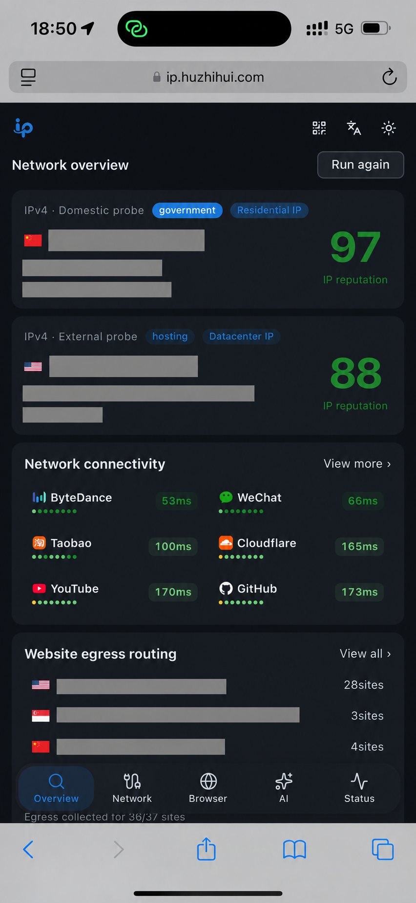

# One IP

<p align="left">
  
  
  
  
  
  
  
  
  
  
  
  
</p>

IP 查询、网络诊断、浏览器检测与 AI 服务状态工具箱。

**中文** · [English](README.en.md)

[开源版在线体验](https://ip.huzhihui.com/) · [GitHub](https://github.com/zhihui-hu/one-ip)

以下 Cloudflare 一键部署入口适用于开源版 `main` 分支。

[](https://deploy.workers.cloudflare.com/?url=https%3A%2F%2Fgithub.com%2Fzhihui-hu%2Fone-ip)

## 商业版本（commercial）

`commercial` 分支保留原有 IP 工具，增加 `/login` 和 `/dashboard/admin`。Rust [后端](../backend/README.md)提供静态页面与全部 `/api/*`，负责诊断数据、本地登录及 Turnstile 人机验证、权限和审计；浏览器出口、站点连通性及浏览器特征仍由访问者的浏览器直接检测。

```sh
cd ../backend
# 新库先 make init；已有库先按后端 README 执行迁移
make bootstrap-admin
make dev  # Rust 27528 + Vite 27529
```

Vite 将 `/api/*` 代理到 Rust。商业版运行、测试与部署不需要 Wrangler；`pnpm test` 运行无需 Worker 构建的测试。`pnpm test:worker` 保留开源版 Worker 测试。下文 Cloudflare 部署教程仅适用于 `main` 分支，不适用于商业版。

本分支暂未实现套餐、计费、API Key 和额度。本地登录和公网诊断结果需要在目标环境验证。

## Cloudflare 部署教程

本节仅适用于开源版 `main` 分支。商业版请使用上方 Rust 后端入口。

1. [Fork 本项目](https://github.com/zhihui-hu/one-ip/fork)到你的 GitHub 账号。
2. 登录 [Cloudflare 控制台](https://dash.cloudflare.com/)，进入 **Workers & Pages**，创建 Worker，选择导入 Git 仓库。
3. 连接 GitHub，选择你的 `one-ip` Fork，生产分支填 `main`。
4. 构建命令填 `pnpm build`，部署命令填 `pnpm deploy`。使用 Node.js 24 和 pnpm 10.32.1，根目录保持默认。
5. 点击部署，完成后打开 `workers.dev` 地址。自定义域名在 Worker 设置中绑定。

项目使用 **Cloudflare Workers + Static Assets**，`/api/*` 接口需要 Worker。基础功能无需应用环境变量或 API Key。Turnstile 和 reCAPTCHA 的配置见“验证体验”。

国内网络访问地图时，建议在 Worker → Settings → Variables and Secrets 配置 `TIANDITU_TOKEN`（也可以用 `pnpm exec wrangler secret put TIANDITU_TOKEN`）。配置后地图优先使用天地图，失败时回退到 OpenStreetMap；未配置时保持 OpenStreetMap。

Workers Builds 会在 `main` 收到提交时构建和部署。上方按钮使用原项目地址；需要保留 Fork 关系和更新工作流时，请按教程导入你的 Fork。

## 功能

| 模块             | 支持的功能                                                                                                |
| ---------------- | --------------------------------------------------------------------------------------------------------- |
| 首页概览         | 国内与外部 IPv4 探测、归属地、运营商、信誉分与类型标签                                                    |
| IP 详情          | IPv4 / IPv6 查询、ASN、CIDR、注册信息、网络属性、风险标记、地图、多源位置对比与关联地址；字段取决于数据源 |
| 网站分流与连通性 | 检查不同网站的出口 IP，按地址汇总；多轮 HTTP 采样、中位耗时与排序                                         |
| 全球 Ping        | Globalping 全球探针、地区与城市选择、延迟与丢包、分批返回结果                                             |
| DNS / CDN        | DNS 解析出口、CDN 命中节点及可读取的缓存信息                                                              |
| WHOIS            | 域名、IP、ASN 的 RDAP 注册资料与原始响应                                                                  |
| 浏览器检测       | 环境信息、FingerprintJS 指纹、环境一致性、CreepJS 深度检测、自动化特征、权限与 WebRTC                     |
| AI 访问          | ChatGPT、Claude、Grok、Perplexity、Gemini、DeepSeek、通义千问、Kimi 的资源连通性与部分平台出口对照        |
| 服务状态         | 聚合官方运行状态、故障、维护、组件与事件详情                                                              |
| 使用体验         | 中英文、深浅主题、移动端布局与底部抽屉、查询历史、二维码分享与复制链接                                    |
| 可选验证体验     | Cloudflare Turnstile、Google reCAPTCHA v3；入口需要配置和域名匹配                                         |

第三方服务的限流和跨域限制会影响查询结果。HTTP 耗时与 ICMP Ping 的测量方式不同。IP 类型和信誉分供参考，不代表 AI 平台的官方判断。

### WebMCP

支持浏览器原生 WebMCP：在提供 `document.modelContext` 的浏览器中，页面会注册结构化工具，覆盖 IP / WHOIS / 子域名查询、网络与 AI 检测、服务状态及浏览器诊断。`one_ip_catalog` 可列出支持的站点、平台和页面；`one_ip_open_page` 可导航到需要用户操作的权限与人机校验页面。工具使用现有数据源和请求限制，支持取消；不支持 WebMCP 的浏览器仍可正常使用网页。

WebMCP 仍处于实验阶段。本地可在 Chrome 开启 `chrome://flags/#enable-webmcp-testing` 后检查 `await document.modelContext.getTools()`；线上 Chrome 访问需要参与 [WebMCP Origin Trial](https://developer.chrome.com/docs/ai/webmcp/) 或等待浏览器正式支持。本站没有内置试验令牌。工具只在当前页面同源暴露，不向跨源 iframe 授权。查询结果可能包含第三方数据；浏览器指纹、出口 IP 和 WebRTC 结果可能涉及隐私，调用前应由用户决定是否交给代理处理。

## 终端与 API

部署此版本后，可通过 `GET /api/ip/health` 查询 IP 健康度，无需 API Key。

```bash
# 当前请求的公网出口 IP，终端文本
curl -fsS 'https://ip.huzhihui.com/api/ip/health?format=text'

# 默认返回 JSON，便于脚本处理
curl -fsS 'https://ip.huzhihui.com/api/ip/health'

# 指定公网 IPv4 或 IPv6
curl -fsS 'https://ip.huzhihui.com/api/ip/health?ip=1.1.1.1'
curl -fsS 'https://ip.huzhihui.com/api/ip/health?ip=2606:4700:4700::1111&format=text'
```

自部署时替换域名。本地开发使用 `http://127.0.0.1:27528`，必须指定 `ip`。省略 `ip` 时使用 Cloudflare 识别的本次请求出口；经过代理时会查询代理出口。

返回 `ip`、`checked_at`、`score`、`status`、位置、ISP、ASN 和 `flags`（住宅、数据中心、移动网络、VPN、代理、Tor、爬虫、滥用标记）。信誉分范围 0–100，越高越好；与网页相同，75–100 为 `good`、45–74 为 `moderate`、低于 45 为 `poor`。缺失或无效分数返回 `score: null`、`status: "unknown"`；缺失标记返回 `null`，不视为 `false`。

`format` 支持 `json`（默认）和 `text`。错误始终返回 JSON `{ "error": "…" }`：无效参数为 400、限流为 429、无法识别访客 IP 为 503、数据源故障或地址不匹配为 502。接口沿用现有请求限流，响应不缓存。健康度仅表示第三方 IP 信誉，不包含终端网络测速、浏览器检测或 AI 账号可用性判断。

## 界面预览

截图遮盖了 IP、具体位置及运营商 / ASN，数值不是实时结果。


<table>
  <tr><th>手机 · 浅色</th><th>手机 · 深色</th></tr>
  <tr>
    <td></td>
    <td></td>
  </tr>
</table>

## 商务合作

One IP 面向企业提供闭源商业版本及配套服务，适合网络与浏览器环境检测、AI 服务连通性诊断、批量验收和持续监测等场景。可合作内容包括：

- 企业版授权与团队协作
- 私有化部署与数据隔离
- 定制开发、系统集成与 API 接入
- 技术咨询、部署实施与持续支持

如需了解商业版本、私有化部署或定制方案，请发送邮件至 [ip@huzhihui.com](mailto:ip@huzhihui.com)，并说明使用场景、部署方式和预计规模；项目详情可参阅 [GitHub 仓库](https://github.com/zhihui-hu/one-ip)。具体服务范围、数据权限与交付方式以双方约定为准。

## Fork 更新

在 GitHub 仓库页面点击 **Sync fork → Update branch**。有代码改动时检查差异，通过合并处理冲突。

定时同步使用 `Sync upstream` 工作流：

1. 在 Fork 的 Actions 页面启用工作流。
2. 在 Settings → Secrets and variables → Actions → **Variables** 添加 `AUTO_SYNC_UPSTREAM=true`。
3. 工作流在每天 UTC 04:23 检查更新。Actions 页面提供运行入口。

支持范围是从 `zhihui-hu/one-ip` 创建的 Fork，无需个人访问令牌（PAT）。工作流通过 GitHub 的 `merge-upstream` 接口合并更新，遇到冲突时停止，保留你的提交。需要审核更新时，使用 GitHub 的 Sync fork。

- **Workers Builds**：连接 Fork 的生产分支，在 Cloudflare 构建历史中检查同步提交的部署记录。
- **GitHub Actions 部署**：同步产生更新时，工作流触发部署任务。`GITHUB_TOKEN` 产生的推送不会触发普通 `push` 工作流。
- 分支保护阻止合并时，通过 PR 处理。
- Fork 的定时工作流需要启用。公开仓库 60 天无活动可能导致 GitHub 停用定时任务，恢复入口在 Actions 页面。

参考：[同步 Fork](https://docs.github.com/en/pull-requests/how-tos/work-with-forks/syncing-a-fork)、[GITHUB_TOKEN 触发规则](https://docs.github.com/en/actions/concepts/security/github_token)、[定时工作流停用规则](https://docs.github.com/en/actions/how-tos/manage-workflow-runs/disable-and-enable-workflows)。

## GitHub Actions 部署（可选）

Workers Builds 和 GitHub Actions 选择一种部署方式，避免重复发布。Actions 默认执行构建和测试；开启部署需要在仓库的 Actions 设置中添加：

| 类型     | 名称                    | 用途                       |
| -------- | ----------------------- | -------------------------- |
| Variable | `ENABLE_CF_DEPLOY=true` | 开启部署                   |
| Secret   | `CLOUDFLARE_API_TOKEN`  | 目标账户的 Worker 部署凭证 |
| Secret   | `CLOUDFLARE_ACCOUNT_ID` | 目标 Cloudflare 账户 ID    |

推送到 `main`，或运行 `Build and deploy one-ip`。构建和测试通过后进入部署。外部 PR 执行测试，不获得部署凭证。这些凭证用于 CI。

## 本地开发与部署

以下命令适用于开源版 `main` 分支。商业版从 `../backend` 运行 `make dev`。

```bash
pnpm install --frozen-lockfile
pnpm worker:dev
```

打开 `http://127.0.0.1:27528`。命令启动 Vite（27529）和本地 Worker（27528），支持热更新。启动脚本为本地进程设置 `LOCAL_DEV=true`，无需修改 Wrangler 配置。

```bash
pnpm build
pnpm test
pnpm lint

# 登录 Cloudflare 并部署
pnpm exec wrangler login
pnpm deploy
```

`pnpm deploy` 使用 `dist` 中的构建产物，运行前需要执行 `pnpm build`。`make deploy` 包含版本更新、构建和部署，无需密钥文件。

## 验证体验（可选）

选择 Turnstile 或 reCAPTCHA，填写 Site Key、Secret 和允许访问的域名。配置齐全且访问域名匹配时，页面显示“验证体验”入口；缺少配置时隐藏入口。

| 提供商       | 配置项                                                          |
| ------------ | --------------------------------------------------------------- |
| Turnstile    | `TURNSTILE_SITE_KEY`、`TURNSTILE_SECRET`、`TURNSTILE_HOSTNAMES` |
| reCAPTCHA v3 | `RECAPTCHA_SITE_KEY`、`RECAPTCHA_SECRET`、`RECAPTCHA_HOSTNAMES` |

本地开发：把[配置示例](docs/config/challenges.env.example)复制到根目录 `.dev.vars`，填写密钥并重启。文件存在时编辑原文件。域名用逗号分隔，填写格式为 `example.com`，提供商控制台需要允许对应域名。

线上部署：在 Worker → Settings → Variables and Secrets 填写配置，或执行 `pnpm exec wrangler secret put 名称`。使用配置文件时，把 `.secrets.example` 复制为 `.secrets.production.env`，填写后运行：

```bash
node scripts/sync-worker-secrets.mjs production --check
node scripts/sync-worker-secrets.mjs production
```

脚本上传非空项，保留已有 Secret，跳过缺失的可选文件。敏感文件在 Git 忽略列表中。Secret 应放在 Worker 配置中，不能放进 `VITE_*`。`/api/browser/challenges` 的 `configured` 字段用于检查配置结果。

reCAPTCHA 使用 v3 评分型密钥。服务端校验 hostname、`browser_check` action 和 score，通过阈值为 0.5。v2 复选框和 Enterprise assessment 不在支持范围内，生产环境不接受 localhost。

## 项目结构与数据来源

数据来源按版本区分：开源版本使用互联网公开可访问的数据和第三方公开接口；闭源商业版本支持私有化部署，使用私有部署环境中的数据。具体数据范围、留存方式和使用权限以商业方案及合同约定为准。

- `src/app.css`：界面样式；`src/components/ui`：shadcn/ui 组件。
- `src/views`：网络、浏览器、AI 与状态页面；`public/worker`：Worker API。
- Net.Coffee：IP 详情，展示字段取决于接口返回。
- Globalping：全球测量；IANA / RDAP：注册资料；各平台官方状态源：运行状态。
- FingerprintJS 与 CreepJS：浏览器检测，模块说明见 [vendor/browser-diagnostics](vendor/browser-diagnostics/README.md)。

欢迎提交 Issue 和改进建议。分享截图前，请遮盖 IP、位置和指纹标识等隐私信息。

### 人机校验与 Claude 环境对照

人机校验打开页面后自动运行，展示 Turnstile 状态和 reCAPTCHA v3 分数（通过阈值 0.50）；单轮最长等待 45 秒，可重试。

可选的第二个 Turnstile 组件使用 `TURNSTILE_NONINTERACTIVE_SITE_KEY`、`TURNSTILE_NONINTERACTIVE_SECRET` 和 `TURNSTILE_NONINTERACTIVE_HOSTNAMES`，并须在 Cloudflare 中选择 **Non-interactive** 模式；未配置时不显示。

Claude 页面比较 `claude.ai` 与 `claude.com` 出口，并检查 DNS、WebRTC、语言、时区及浏览器特征。检测字典参考 [FuckClaude](https://github.com/LinXiaoTao/FuckClaude)，许可证和来源说明见 `vendor/claude-environment/`。

以上结果仅用于环境排查，不代表 Claude 官方判定、账号风险或封禁概率；页面不读取本机 Claude Code 配置，也不展示 Cloudflare 企业版 Bot Management 分数。

社区友链：[LINUX DO](https://linux.do/) · 真诚、友善、团结、专业。
